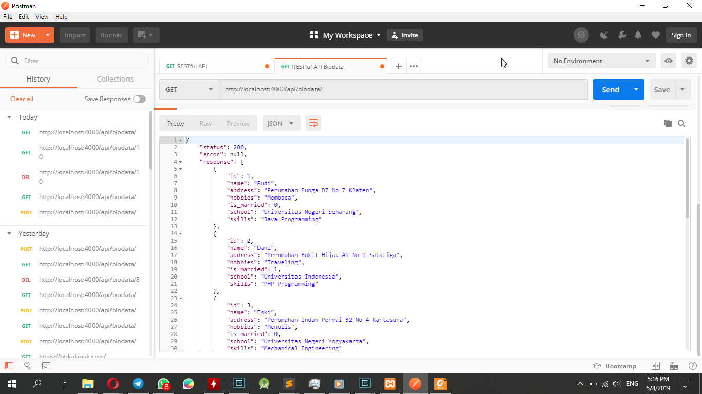

# RESTful API Biodata

RESTful API Biodata menggunakan Node.js dan MySQL

Data yang didapat berupa data produk yaitu:

1. Nama / name(string)
2. Alamat / address (String)
3. Hobi / hobbies (Array)
4. Apakah sudah Menikah / is_married (Boolean)
5. Sekolah / school (Obj) with key highSchool, and university
6. Keahlian / skills (Array of Obj)

Membutuhkan 3 dependencies yaitu:

1. Express (node.js framework)

2. MySQL (driver mysql untuk node.js)

3. Body-parser (middleware untuk menghandle post body request)

Membuat database-nya menggunakan MySQL pada PHPMyAdmin.

Menggunakan POSTMAN untuk menguji API yang telah dibuat.

Screenshot

Referensi: http://mfikri.com/artikel/restful-api